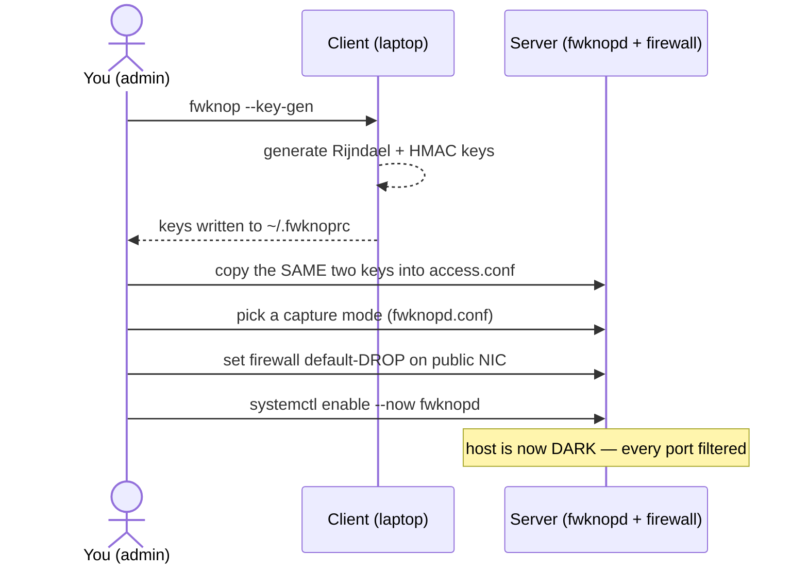
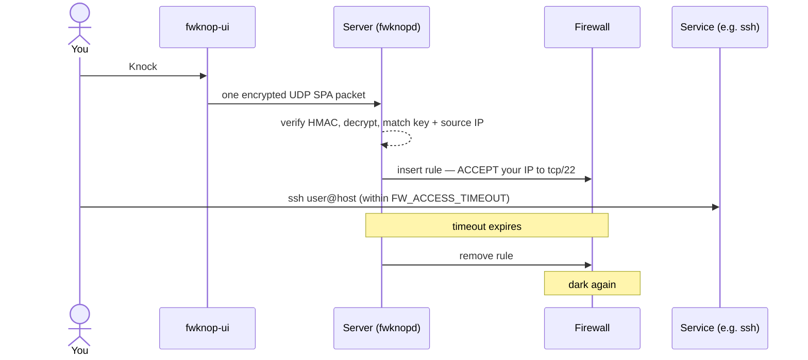

# How it works

Single Packet Authorization has exactly **two flows**, and the whole system makes sense
once you separate them:

- **Provisioning** — done **once per host**. You generate a key pair, hand the daemon a
  copy, and close the firewall. After this, the host is dark to the internet.
- **Access** — done **every time you need in**. You send one encrypted packet (the knock),
  the daemon opens a short-lived hole for your IP, and you connect through it.

The rest of Getting started is one page per flow: [Set up a host](/docs/getting-started/set-up-a-host)
is Provisioning, [Access a service](/docs/getting-started/access-services) is Access. This
page is the map they share.

> **Who holds what.** The **keys** live in two places only: the client's `~/.fwknoprc` and
> the server's `access.conf`. fwknop-ui never stores them — it drives the client by stanza
> *name* and lets `fwknop` read the keys itself. See the [hard invariants](/docs/getting-started/access-services).

---

## Flow 1 — Provisioning (one-time, per host)

You prepare the host: create keys, share the server half, and arm the firewall so the box
goes dark. You do this once; after that you never touch the server for day-to-day access.

Full walkthrough with the exact commands and parameters:
[Set up a host](/docs/getting-started/set-up-a-host).

## Flow 2 — Access (every time, per session)

The host is dark. To get in you **knock**, then **connect** inside the timeout window.
This is the only flow you repeat — and the only one this console drives.

A knock that fails leaves the host dark — there is nothing to brute-force. Full walkthrough:
[Access a service](/docs/getting-started/access-services).

## Why split them this way

| | **Provisioning** | **Access** |
|---|---|---|
| How often | once per host | every session |
| Where you work | on the server (this one time) | from this console (or the CLI) |
| What moves | keys + config + firewall policy | a single encrypted packet |
| End state | host goes dark | a short-lived hole for your IP, then dark again |

Everything else in these docs — the [use cases](/docs/use-cases/ssh-blocker) — is just a
variation on Flow 1's `access.conf`: *which* ports Flow 2 opens when you knock.
